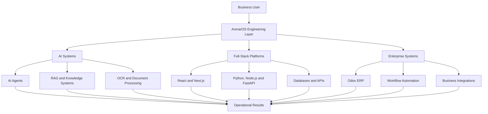

<div align="center">


```text
╔══════════════════════════════════════════════════════════════════╗
║                                                                  ║
║                         ANMAR OS                                  ║
║                                                                  ║
║              AI Systems Development Environment                  ║
║                                                                  ║
╚══════════════════════════════════════════════════════════════════╝
```


<br/>

[](https://anmarrahman.vercel.app/)
[](https://www.linkedin.com/in/anmarrahman/)
[](mailto:anmar.rahman.dev@gmail.com)

<br/>


</div>

---

## `01 // SYSTEM_IDENTITY`

```yaml
system:
  name: "AnmarOS"
  operator: "Anmar Rahman"
  location: "Montreal, Quebec, Canada"
  status: "ONLINE"

roles:
  primary: "AI Systems Developer & Techno-Functional Consultant"
  secondary: "Co-Founder & Lead Developer"

specializations:
  - "Enterprise AI"
  - "Business Automation"
  - "Full-Stack Engineering"
  - "ERP Systems"
  - "Intelligent Document Processing"

organizations:
  - name: "Canada Europe Ltée (Condor)"
    role: "AI Systems Developer & Techno-Functional Consultant"

  - name: "Symantriq"
    role: "Co-Founder & Lead Developer"
```

I design and build intelligent software that solves real business problems.

At **Canada Europe Ltée**, I work on AI and digital transformation initiatives, including enterprise automation, Odoo ERP customization, OCR pipelines, system integrations and internal business tools.

At **Symantriq**, I lead the development of AI-powered web applications, dashboards, automation platforms and scalable software solutions for clients.

My work connects three core systems:

```text
BUSINESS OPERATIONS  <────>  SOFTWARE ENGINEERING  <────>  ARTIFICIAL INTELLIGENCE
```

---

## `02 // SYSTEM_STATUS`

<table>
<tr>
<td width="50%" valign="top">

### Core Services

```text
AI CORE                [ ONLINE ]
AUTOMATION ENGINE      [ ONLINE ]
FULL-STACK RUNTIME     [ ONLINE ]
ODOO ERP CONNECTOR     [ ONLINE ]
OCR PIPELINE           [ ONLINE ]
API GATEWAY            [ ONLINE ]
DATABASE LAYER         [ ONLINE ]
COFFEE MODULE          [ REQUIRED ]
```

</td>
<td width="50%" valign="top">

### Current Objectives

```text
[■] Enterprise AI systems
[■] Business workflow automation
[■] Odoo ERP customization
[■] Intelligent document processing
[■] Internal business platforms
[■] Scalable client applications
[■] AI assistants and agents
```

</td>
</tr>
</table>

---

## `03 // ACTIVE_PROCESSES`

```bash
anmar@anmar-os:~$ ps --active
```

|   PID  | Process                      | Organization       |   State   |
| :----: | ---------------------------- | ------------------ | :-------: |
| `1001` | Enterprise AI Systems        | Canada Europe Ltée | `RUNNING` |
| `1002` | Business Workflow Automation | Canada Europe Ltée | `RUNNING` |
| `1003` | Odoo ERP Extensions          | Canada Europe Ltée | `RUNNING` |
| `1004` | OCR & Document Processing    | Canada Europe Ltée | `RUNNING` |
| `1005` | AI-Powered Client Platforms  | Symantriq          | `RUNNING` |
| `1006` | Full-Stack Web Applications  | Symantriq          | `RUNNING` |
| `1007` | Applied AI Research          | Personal Lab       | `RUNNING` |

---

## `04 // PROFESSIONAL_RUNTIME`

<details open>
<summary><strong>PID 1001 — Canada Europe Ltée (Condor)</strong></summary>

<br/>

### AI Systems Developer & Techno-Functional Consultant

`July 2026 – Present` · `Montreal, Canada` · `Hybrid`

```text
MISSION:
Transform business operations through AI, automation and connected systems.
```

* Working directly with leadership on AI and digital transformation initiatives
* Designing and implementing AI-powered business workflows
* Customizing and extending Odoo ERP
* Building OCR and intelligent document-processing pipelines
* Developing internal tools for data processing and system integrations
* Creating centralized systems for projects, workflows, meetings and documentation
* Optimizing processes across sales, purchasing, operations and supply chain

</details>

<details>
<summary><strong>PID 1002 — Symantriq</strong></summary>

<br/>

### Co-Founder & Lead Developer

`January 2024 – Present` · `Montreal, Canada` · `Remote`

```text
MISSION:
Build digital products that combine software, automation and AI.
```

* Built and deployed AI-powered platforms used by real clients
* Developed more than 20 scalable web applications
* Created AI chatbots, dashboards and automation platforms
* Led projects from initial requirements through production deployment
* Designed responsive interfaces and scalable backend systems
* Collaborated remotely on international client projects

[Visit Symantriq](https://www.symantriq.com/)

</details>

<details>
<summary><strong>PID 1003 — Freelance</strong></summary>

<br/>

### Frontend & AI Developer

`May 2022 – Present`

* Developing modern React and Next.js applications
* Building responsive and SEO-optimized websites
* Integrating APIs, databases and cloud services
* Improving application speed, accessibility and user experience
* Working with Firebase, Python and modern deployment platforms

</details>

<details>
<summary><strong>PID 1004 — Artur Art</strong></summary>

<br/>

### Frontend Developer Intern

`January 2026 – March 2026`

* Developed performant React and Next.js interfaces
* Built responsive and pixel-accurate pages
* Integrated frontend applications with backend APIs
* Improved website performance and usability
* Collaborated within a professional software development workflow

</details>

---

## `05 // FEATURED_MODULES`

```bash
anmar@anmar-os:~$ ls ./featured-projects
```

<table>
<tr>
<td width="50%" valign="top">

### `parsley/`

**Restaurant Ordering Platform**

A responsive restaurant platform built to provide customers with a modern digital experience and streamlined access to menu and ordering information.

```yaml
type: Restaurant Platform
stack:
  - React
  - Node.js
  - Square
  - REST APIs
status: Deployed
```

[Launch Parsley](https://parsleyct.com/)

</td>
<td width="50%" valign="top">

### `condor-website/`

**Industrial E-Commerce Platform**

A modern product and e-commerce experience designed for an industrial hardware and supplies business.

```yaml
type: E-Commerce Platform
stack:
  - Next.js
  - TypeScript
  - Responsive Design
  - Product Catalog
status: Deployed
```

[Launch Condor Website](https://condorwebsite.vercel.app/)

</td>
</tr>

<tr>
<td colspan="2" valign="top">

### `symantriq/`

**AI-Powered Software Studio**

A software development company focused on AI-powered web applications, business platforms, automation systems and scalable digital products.

```yaml
type: Software Agency
services:
  - AI-Powered Applications
  - Full-Stack Development
  - Business Automation
  - Custom Web Platforms
  - Dashboards and Internal Tools
status: Operating
```

[Visit Symantriq](https://www.symantriq.com/)

</td>
</tr>
</table>

---

## `06 // INSTALLED_MODULES`

<div align="center">

### Languages


<br/><br/>

### Frontend Systems


<br/><br/>

### Backend & APIs


<br/><br/>

### Data Layer


<br/><br/>

### Infrastructure & Development


<br/><br/>

### Enterprise Intelligence Layer


</div>

---

## `07 // SYSTEM_ARCHITECTURE`



---

## `08 // CERTIFICATION_REGISTRY`

<div align="center">


<br/><br/>


</div>

---

## `09 // SYSTEM_ANALYTICS`

<div align="center">


<br/>


<br/>


</div>

---

## `10 // COMMAND_TERMINAL`

```bash
visitor@anmar-os:~$ help

Available commands:

  whoami       Display operator identity
  mission      Display current objective
  projects     List active project modules
  skills       Scan installed technologies
  experience   Display professional runtime
  contact      Open communication channels
  status       Run system diagnostics
```

```bash
visitor@anmar-os:~$ whoami

Anmar Rahman
AI Systems Developer
Techno-Functional Consultant
Software Engineer
Co-Founder
```

```bash
visitor@anmar-os:~$ mission

Build intelligent systems that connect artificial intelligence,
software engineering and real business operations.
```

```bash
visitor@anmar-os:~$ projects

01  Parsley
02  Condor Website
03  Symantriq
```

```bash
visitor@anmar-os:~$ status

AI Core ...................... ONLINE
Automation Engine ............ ONLINE
Enterprise Integrations ...... ONLINE
Full-Stack Runtime ........... ONLINE
Problem-Solving Module ....... ONLINE
New Opportunities ............ ACCEPTING CONNECTIONS
```

---

## `11 // OPEN_CONNECTION`

<div align="center">

### Have a system to improve, automate or build?

I am interested in projects involving **enterprise AI**, **business automation**, **full-stack platforms**, **ERP customization** and **intelligent internal tools**.

<br/>

[](https://anmarrahman.vercel.app/)
[](https://www.linkedin.com/in/anmarrahman/)
[](mailto:anmar.rahman.dev@gmail.com)

<br/><br/>

```text
visitor@anmar-os:~$ connect --operator anmar

Establishing secure connection...
Connection channel ready.

visitor@anmar-os:~$ _
```


</div>
