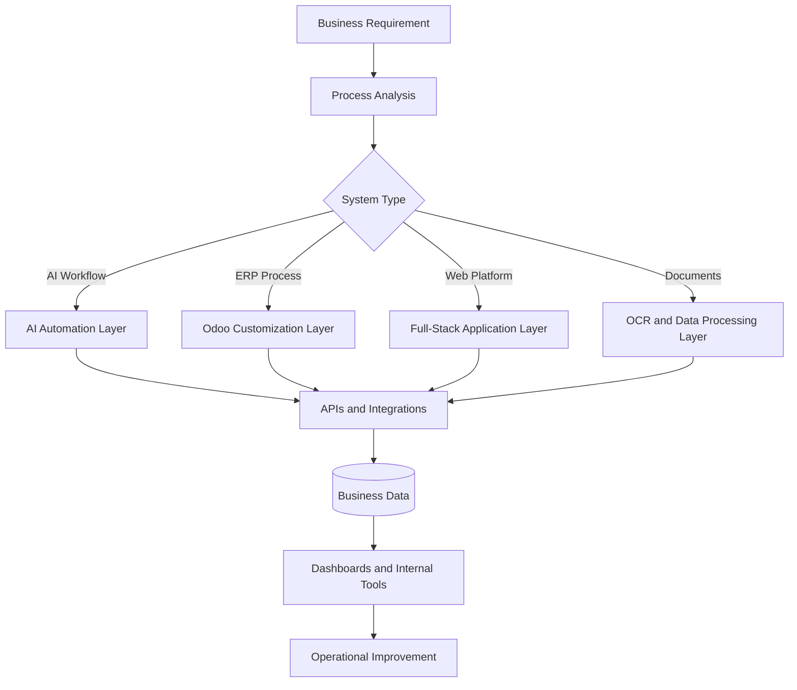

<div align="center">

<h1><code>ANMAR OS</code></h1>

<p><code>AI-POWERED ENTERPRISE SYSTEMS</code></p>


<br/>

<a href="https://anmarrahman.vercel.app/" target="_blank" rel="noopener noreferrer"></a>
<a href="https://www.linkedin.com/in/anmarrahman/" target="_blank" rel="noopener noreferrer"></a>
<a href="mailto:anmar.rahman.dev@gmail.com"></a>

<br/><br/>


</div>

---

## `01 // SYSTEM_IDENTITY`

```yaml
system:
  name: AnmarOS
  operator: Anmar Rahman
  location: Montreal, Quebec, Canada
  status: ONLINE

runtime:
  primary_role: AI Systems Developer
  secondary_role: Techno-Functional Consultant
  additional_role: Co-founder & Lead Developer

focus:
  - AI-powered business automation
  - Enterprise systems and ERP customization
  - Full-stack web platforms
  - OCR and intelligent document processing
  - Workflow and systems integration
  - Internal business tools

languages:
  - English
  - French
  - Arabic
```

I build practical systems that connect **AI, automation, enterprise software, and modern web development**.

My work focuses on turning manual business processes into structured digital workflows, building internal tools, extending ERP systems, and developing production-ready web platforms for real organizations.

---

## `02 // SYSTEM_STATUS`

<table>
<tr>
<td width="50%" valign="top">

### `CORE_RUNTIME`

```text
AI Systems Development        ACTIVE
Enterprise Automation         ACTIVE
Odoo ERP Customization        ACTIVE
Full-Stack Engineering        ACTIVE
OCR & Data Processing         ACTIVE
System Integrations           ACTIVE
```

</td>
<td width="50%" valign="top">

### `CURRENT_OBJECTIVES`

```text
Build scalable AI workflows
Automate repetitive operations
Centralize business knowledge
Improve enterprise visibility
Connect fragmented systems
Ship useful production software
```

</td>
</tr>
</table>

---

## `03 // ACTIVE_PROCESSES`

| PID | Process | State | Description |
|---:|---|---|---|
| `001` | `AI_AUTOMATION_ENGINE` | `RUNNING` | Designing AI-powered workflows that reduce manual work |
| `002` | `ODOO_EXTENSION_LAYER` | `RUNNING` | Customizing ERP workflows across business operations |
| `003` | `OCR_PROCESSOR` | `RUNNING` | Extracting and structuring data from business documents |
| `004` | `WEB_PLATFORM_RUNTIME` | `RUNNING` | Building scalable applications with React and Next.js |
| `005` | `INTEGRATION_SERVICE` | `RUNNING` | Connecting tools, APIs, databases, and internal systems |
| `006` | `BUSINESS_PROCESS_OPTIMIZER` | `RUNNING` | Improving sales, purchasing, supply chain, and operations |

---

## `04 // PROFESSIONAL_RUNTIME`

### `Canada Europe Ltée (Condor)`

**AI Systems Developer & Techno-Functional Consultant**  
`July 2026 — Present` · Montreal, Quebec, Canada · Hybrid

```text
STATUS      Permanent Full-time
ACCESS      Leadership-level collaboration
SCOPE       AI, automation, ERP, integrations, internal systems
```

- Work directly with leadership on AI and digital transformation initiatives.
- Design and implement AI-powered automation and business workflows.
- Customize and extend Odoo ERP to streamline internal operations.
- Develop tools for OCR, document processing, data extraction, and integrations.
- Build internal systems that centralize projects, workflows, meetings, and documentation.
- Improve processes across sales, purchasing, supply chain, and operations.

<br/>

### `Symantriq`

**Co-founder & Lead Developer**  
`January 2024 — Present` · Montreal, Quebec, Canada · Remote

```text
STATUS      Active
ROLE        Product engineering and technical leadership
OUTPUT      AI platforms, dashboards, business websites, web applications
```

- Built and deployed AI-powered platforms, dashboards, and chatbot systems used by real clients.
- Developed 30+ web applications using React, Next.js, Python, and modern cloud tools.
- Led architecture, implementation, deployment, and ongoing product improvements.
- Worked directly with clients to translate business requirements into working software.
- Built reusable systems for authentication, admin dashboards, analytics, payments, and automation.

<br/>

### `L'Original x Artur.art`

**Software Developer Intern**

- Contributed to real software development tasks in a professional environment.
- Worked with existing codebases, technical requirements, and collaborative workflows.
- Strengthened practical experience in debugging, implementation, and software delivery.

---

## `05 // FEATURED_MODULES`

<table>
<tr>
<td width="33%" valign="top"><code>MODULE_01</code></td>
<td width="33%" valign="top"><code>MODULE_02</code></td>
<td width="33%" valign="top"><code>MODULE_03</code></td>
</tr>
<tr>
<td valign="top"><h2>Parsley</h2></td>
<td valign="top"><h2>Condor Website</h2></td>
<td valign="top"><h2>Symantriq</h2></td>
</tr>
<tr>
<td valign="top">Restaurant platform designed for a real business, with a modern customer-facing experience and production deployment.</td>
<td valign="top">Modern business and e-commerce website for Canada Europe Ltée, presenting products, services, and company information.</td>
<td valign="top">Digital agency platform presenting AI solutions, web development services, products, and technology capabilities.</td>
</tr>
<tr>
<td valign="top"><strong>Runtime</strong></td>
<td valign="top"><strong>Runtime</strong></td>
<td valign="top"><strong>Runtime</strong></td>
</tr>
<tr>
<td valign="top">
<ul>
<li>React</li>
<li>Node.js</li>
<li>Square integrations</li>
<li>Responsive UI</li>
<li>Production deployment</li>
</ul>
</td>
<td valign="top">
<ul>
<li>Next.js</li>
<li>React</li>
<li>Responsive layouts</li>
<li>Product-focused design</li>
<li>Business architecture</li>
</ul>
</td>
<td valign="top">
<ul>
<li>Next.js</li>
<li>AI product development</li>
<li>Full-stack engineering</li>
<li>Client solutions</li>
<li>Cloud deployment</li>
</ul>
</td>
</tr>
<tr>
<td valign="top"><strong>System Link</strong></td>
<td valign="top"><strong>System Link</strong></td>
<td valign="top"><strong>System Link</strong></td>
</tr>
<tr>
<td valign="top"><a href="https://parsleyct.com/" target="_blank" rel="noopener noreferrer"></a></td>
<td valign="top"><a href="https://condorwebsite.vercel.app/" target="_blank" rel="noopener noreferrer"></a></td>
<td valign="top"><a href="https://www.symantriq.com/" target="_blank" rel="noopener noreferrer"></a></td>
</tr>
</table>

---

## `06 // CAPABILITY_MATRIX`

### `AI_AND_AUTOMATION`
- AI Workflows
- Business Automation
- OCR Pipelines
- LLM Integrations

### `ENTERPRISE_SYSTEMS`
- Odoo ERP
- CRM & Helpdesk
- Supply Chain
- Business Analysis

### `SOFTWARE_ENGINEERING`
- Full-Stack Development
- REST APIs
- Cloud Deployment
- Authentication

---

## `07 // INSTALLED_MODULES`

### `LANGUAGES`

<p>
  
</p>

### `FRONTEND`

<p>
  
</p>

### `BACKEND_AND_DATA`

<p>
  
</p>

### `TOOLS_AND_INFRASTRUCTURE`

<p>
  
</p>

### `ENTERPRISE_AND_AI`

```text
Odoo ERP
REST APIs
OCR pipelines
Business automation
LLM integrations
Workflow orchestration
Data processing
System integration
```

---

## `08 // SYSTEM_ARCHITECTURE`



---

## `11 // CERTIFICATION_REGISTRY`

| Certification | Provider | Status |
|---|---|---|
| Google AI Essentials | Google / Coursera | Completed |
| Generative AI: Elevate Your Software Development Career | IBM / Coursera | Completed |
| Additional AI, cloud, and software certifications | Ongoing learning path | In Progress |

```text
LEARNING_MODE = CONTINUOUS
FOCUS_AREAS  = AI + SOFTWARE + CLOUD + ENTERPRISE_SYSTEMS
```

---

## `12 // SYSTEM_ANALYTICS`

<div align="center">


<br/><br/>


</div>

---

## `13 // SYSTEM_LOG`

```log
[ OK ] AI Core Loaded
[ OK ] Automation Engine Ready
[ OK ] ERP Modules Connected
[ OK ] Web Runtime Active
SYSTEM READY
```

---

## `14 // OPEN_CONNECTION`

<div align="center">

### `LET'S BUILD SOMETHING USEFUL`

I am interested in projects involving AI systems, enterprise automation, ERP solutions, internal business tools, and modern web platforms.

<br/>

<a href="https://anmarrahman.vercel.app/" target="_blank" rel="noopener noreferrer"></a>

<a href="https://www.linkedin.com/in/anmarrahman/" target="_blank" rel="noopener noreferrer"></a>

<a href="mailto:anmar.rahman.dev@gmail.com"></a>

<br/><br/>

<code>ANMAR OS // END OF TRANSMISSION</code>

</div>
